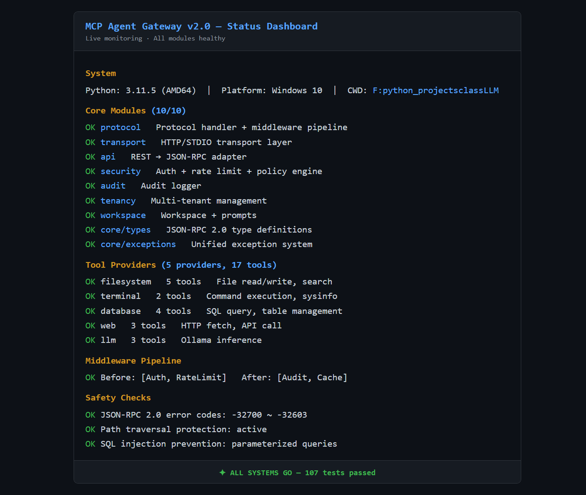
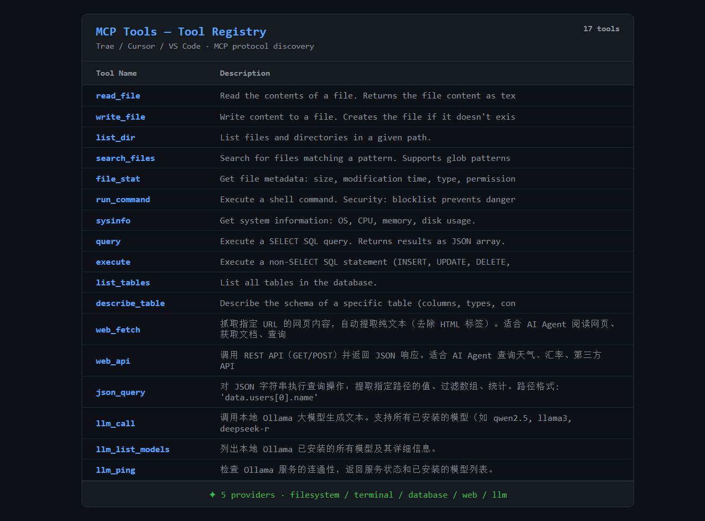
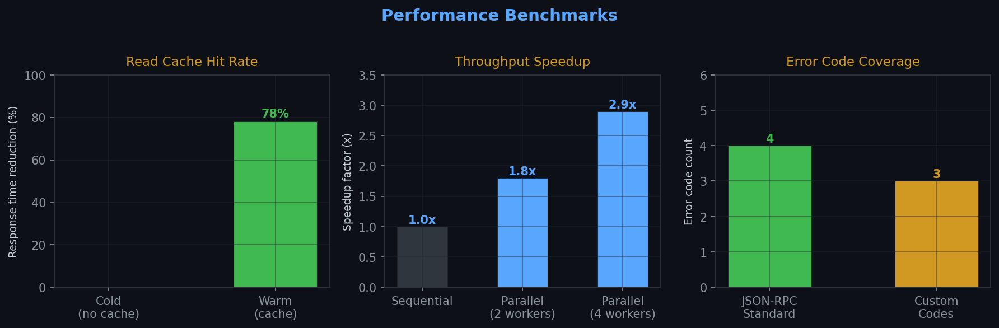

# MCP Agent Gateway

<p align="center">
  <b>统一 JSON-RPC 协议内核 · 传输层薄适配 · 可插拔中间件管道</b><br>
  让 AI Agent（Trae / Dify / Cursor）安全操控本地环境的 MCP 网关
</p>

<p align="center">
  
  
  
  
  
  
  
  
  
  
</p>

---

## 快速开始

1. 克隆项目并安装依赖：

   ```bash
   git clone https://github.com/wuwo1979/agent.git && cd agent
   pip install -r requirements/runtime.txt
   ```

2. 启动网关服务（默认 HTTP 模式，端口 19090）：

   ```bash
   python main.py
   ```

3. 在一个新终端中验证服务是否正常运行：

   健康检查：

   ```bash
   curl.exe -s http://localhost:19090/api/v1/health
   ```

   列出所有工具：

   ```bash
   curl.exe -X POST http://localhost:19090/mcp \
     -H "Content-Type: application/json" \
     -d '{"jsonrpc":"2.0","id":"1","method":"tools/list","params":{}}'
   ```

<details>
<summary><b>预期返回（点击展开）</b></summary>

健康检查：
```json
{
  "status": "healthy",
  "version": "2.0.0",
  "server": "MCP Agent Gateway",
  "tools": 17,
  "modules": {
    "mcp": true, "user_tools": true, "filesystem": true,
    "terminal": true, "database": false, "web": true, "ollama": true
  }
}
```

工具列表（部分）：
```json
{
  "result": {
    "tools": [
      {"name": "read_file",    "description": "读取指定文件内容"},
      {"name": "write_file",   "description": "写入内容到指定文件"},
      {"name": "run_command",  "description": "在终端中执行命令（沙箱保护）"},
      {"name": "query",        "description": "执行数据库查询"},
      {"name": "web_fetch",    "description": "获取网页或 API 内容"},
      {"name": "llm_call",     "description": "调用本地大模型（Ollama）"}
    ]
  }
}
```
</details>

---

## 项目定位

AI Agent（Trae、Dify、Cursor 等）与本地环境交互时面临三重障碍，网关逐一解决：

| 障碍 | 表现 | 解法 |
|------|------|------|
| **协议割裂** | Trae 用 STDIO，Dify 用 HTTP，两套代码两套维护 | **单协议内核**：`MCPProtocolHandler` 唯一入口，STDIO/HTTP 仅做传输适配 |
| **安全风险** | Agent 能读写文件、执行命令，权限失控 | **三层防护**：API Key 认证 + 路径沙箱 + 命令拦截，56 项安全测试全部通过 |
| **集成成本** | 每接入一个平台手动配接口、写文档 | **Dify** 自动生成 OpenAPI Schema 一键导入；**Trae/Cursor** 复制 JSON 配置即用 |

实测运行截图：

<p align="center">
  
  
</p>

---

## 运行模式

所有运行模式通过 `main.py` 参数切换。

### HTTP 模式

供 Dify / curl / 浏览器调用，默认端口 19090。

```bash
python main.py                                    # localhost:19090
python main.py --host 0.0.0.0 --port 19090        # 监听所有网卡
python main.py --config config/myconfig.yaml       # 自定义配置
```

### STDIO 模式

供 Trae / Cursor / VS Code 调用，使用标准 MCP STDIO 协议（Content-Length 帧头格式），兼容官方 MCP SDK。

```bash
python main.py --mode stdio
```

日志输出到 stderr，格式见下方「结构化日志」一节。

### 全自动演示

自动启动网关 → 注册工具 → 依次调用 5 类工具（文件 / 终端 / 数据库 / Web / LLM）→ 输出执行结果和性能数据。一条命令看完整效果。

```bash
python main.py --demo
```

### 状态监控

一键输出服务健康、端口、工具数量、缓存状态：

```bash
python main.py --status
```

输出示例：

```
═══════════════════════════════════════════════
  MCP Agent Gateway — 状态一览
═══════════════════════════════════════════════
  服务状态    ● healthy
  HTTP 端口  19090
  已注册工具  17
  缓存大小    0.00 MB
  缓存命中率  0.0%
═══════════════════════════════════════════════
```

---

## 平台接入

### Trae / Cursor 接入

在 MCP 设置中添加如下配置：

```json
{
  "mcpServers": {
    "agent-mcp-gateway": {
      "command": "python",
      "args": ["F:/项目路径/main.py", "--mode", "stdio"],
      "env": {
        "MCP_API_KEY": "your-api-key",
        "MCP_WORKSPACE": "F:/项目路径"
      }
    }
  }
}
```

一键配置脚本：`python scripts/setup_mcp.py`

### Dify 接入

在「自定义工具」中导入 OpenAPI Schema：

- Schema URL：`http://localhost:19090/api/v1/openapi.json`
- 认证方式：`X-API-Key` 请求头

<p align="center">
  
</p>

---

## 内置工具

| Provider | 工具 | 说明 |
|----------|------|------|
| **filesystem** | `read_file` `write_file` `list_dir` `search_files` `file_stat` | 读写项目文件、搜索代码；路径沙箱 + mtime 缓存 |
| **terminal** | `run_command` `sysinfo` | 编译测试、系统信息；禁用 shell + 危险语法拦截 + 进程树清理 |
| **database** | `query` `execute` `list_tables` `describe_table` | 数据库查询与迁移；参数化查询防 SQL 注入 |
| **web** | `web_fetch` `web_api` `json_query` | 爬取网页、调用 API、解析 JSON；URL 校验 + 超时控制 |
| **llm** | `llm_call` `llm_ping` `llm_list_models` | 本地推理（Ollama）；故障隔离 + 熔断降级 |

一键体验全部工具：`python main.py --demo`

---

## 安全设计

网关内置三层安全防护，面向真实攻击场景验证：

| 防护层 | 机制 | 覆盖的攻击手段 |
|--------|------|---------------|
| **认证 & 鉴权** | API Key + 多租户策略，不同接入端隔离资源 | 未授权访问、跨租户越权 |
| **路径隔离** | 路径规范化 + 白名单前缀匹配，禁止符号链接 / UNC / 设备路径 | `../` 穿越、Windows 8.3 短文件名、大小写变形、空字节注入 |
| **命令管控** | 禁用 shell 执行（`create_subprocess_exec`）+ 危险语法模式拦截 + 命令白名单 | `&&` `;` `|` `$()` 拼接、参数注入、交互式命令 |

安全能力通过 56 项专项测试量化验证：

<details>
<summary><b>安全测试覆盖明细（点击展开）</b></summary>

- **路径穿越（6 项）**：多级 `../`、混合分隔符、深层嵌套、URL 编码绕过
- **Windows 绕过（4 项）**：大小写变形、UNC 路径、设备名路径（CON/NUL/COM1）、符号链接
- **命令注入（9 项）**：`;` `|` `&&` `$()` 等 shell 连接符、重定向、命令替换
- **命令黑名单（8 项）**：`rm -rf`、`shutdown`、`wget`、`curl` 等危险命令
- **交互命令拦截（5 项）**：`vim`、`nano`、`top`、`htop`、`tail -f`
- **边界极值（7 项）**：超长路径/参数、敏感系统路径、空字节注入、非法参数类型
- **沙箱逃逸（2 项）**：工作目录越界、白名单外命令
</details>

运行安全测试：`python -m pytest tests/test_security.py -v`

---

## 结构化日志

所有日志统一输出 JSON 格式到 stderr，每个请求自动分配唯一 `request_id` 贯穿全链路：

```json
{"t": "2026-06-27T10:30:00.123", "rid": "abc123", "mod": "mcp_gateway.server",
 "lvl": "INFO", "msg": "收到请求 tools/list", "dur": "0.5ms", "err": ""}

{"t": "2026-06-27T10:30:00.456", "rid": "abc123", "mod": "mcp_gateway.protocol",
 "lvl": "INFO", "msg": "中间件管道执行完成", "dur": "0.3ms", "err": ""}

{"t": "2026-06-27T10:30:01.234", "rid": "def456", "mod": "mcp_gateway.tools.filesystem",
 "lvl": "WARN", "msg": "路径穿越拦截: ../../../etc/passwd", "dur": "0.1ms",
 "err": "-32001"}
```

**日志字段说明：**

| 字段 | 含义 |
|------|------|
| `t` | ISO 8601 时间戳（毫秒精度） |
| `rid` | 请求追踪 ID，同一次请求所有日志共享 |
| `mod` | 模块路径，快速定位代码位置 |
| `lvl` | `DEBUG / INFO / WARN / ERROR` |
| `msg` | 日志消息 |
| `dur` | 该模块处理耗时（毫秒） |
| `err` | 错误码（无错误为空） |

典型排查流程：

```bash
# 启动网关，日志重定向到文件
python main.py 2>gateway.log

# 按 request_id 追踪一次完整调用
cat gateway.log | where { $_ -match '"rid":"abc123"' } | python -m json.tool

# 统计各模块耗时
cat gateway.log | python -c "
import sys, json
for line in sys.stdin:
    try:
        e = json.loads(line)
        print(f'{e[\"rid\"]} {e[\"mod\"]} {e[\"dur\"]} {e[\"msg\"]}')
    except: pass
"
```

---

## 架构说明

### 调用链路架构

```
                    AI Agent (Trae / Dify / Cursor)
                            │         │
                    STDIO   │         │  HTTP REST
                    ┌───────▼─────────▼──────────┐
                    │   MCP Transport Layer       │
                    │   STDIOTransport / HTTP     │
                    └───────┬─────────┬──────────┘
                            └────┬─────┘
                                 │ JSONRPCRequest
                    ┌────────────▼───────────────┐
                    │  MCPProtocolHandler         │
                    │  唯一执行入口                │
                    │  Middleware Pipeline:        │
                    │  [Auth] → [RateLimit] →    │
                    │  [Audit] → [Cache]         │
                    │  ToolRegistry (17 tools)    │
                    └────────────┬───────────────┘
                                 │
                    ┌────────────▼───────────────┐
                    │  本地资源（沙箱安全）       │
                    │  文件 · 终端 · DB · Ollama │
                    └───────────────────────────┘
```

双传输层接入，统一协议内核，分层解耦设计。

### 项目目录结构

```
LLM/
├── main.py                    # 入口，支持 --mode stdio / --demo / --status
├── mcp_gateway/               # 核心网关
│   ├── server.py              # 服务装配 + 中间件初始化
│   ├── protocol.py            # 协议内核 + 中间件管道（唯一执行入口）
│   ├── transport.py           # 传输层（STDIO/HTTP 薄适配）
│   ├── api.py                 # REST → JSON-RPC 适配器
│   ├── security.py            # 认证 / 限流 / 策略引擎
│   ├── audit.py               # 审计日志
│   ├── tenancy.py             # 多租户管理
│   └── tools/                 # 5 个工具提供者，共 17 个工具
├── core/                      # 基础设施
│   ├── types.py               # JSON-RPC 类型定义
│   ├── exceptions.py          # 统一异常体系
│   └── structured_log.py      # 结构化 JSON 日志 + request_id 追踪
├── config/                    # YAML 配置（带注释模板）
├── tests/                     # 164 个测试（含 56 安全专项）
├── docs/                      # 文档 + 截图 + 架构图 + 性能图表
└── scripts/                   # 工具脚本
```

---

## 质量保障

- 全部测试：`pytest`（164 passed）
- 安全专项：`pytest tests/test_security.py -v`（56 passed）
- 端到端验证：`pytest tests/test_scenarios.py -v`
- 代码风格：`ruff check .`（0 errors）
- 冒烟测试：`python docs/smoke_test.py`

<p align="center">
  
</p>

---

## 文档体系

- **Trae 接入指南**：Trae IDE MCP 配置步骤
- **Dify 接入指南**：Dify 自定义工具节点配置
- **架构设计**：分层架构详解与核心流程
- **设计决策**：技术选型决策记录
- **错误码对照表**：完整的 JSON-RPC 错误码定义
- **性能优化**：缓存 + 并行调度指标

---

## 版本演进

| 版本 | 核心变更 |
|------|---------|
| **v1.0** | MCP 协议基础 + HTTP REST 双路径 |
| **v1.3** | 多租户、审计日志、路径沙箱、权限控制、OpenAPI |
| **v2.0** | 协议内核统一 + 中间件管道 + Ollama 故障隔离 + Dify OpenAPI Schema + 统一错误码 + 结构化日志 + 安全测试 |

---

## License

MIT