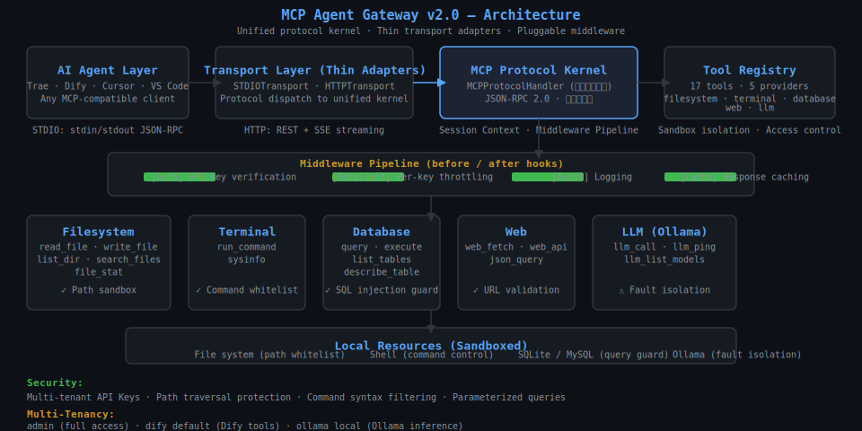

# MCP Agent Gateway

<p align="center">
  <b>统一 JSON-RPC 协议内核 · 传输层薄适配 · 可插拔中间件管道</b><br>
  让 AI Agent（Trae / Dify / Cursor）安全操控本地环境的 MCP 网关
</p>

<p align="center">
  
  
  
  
  
  
  
  
  
  
</p>

---

## 目录

- [快速开始](#快速开始)
- [项目背景](#项目背景)
  - [适用场景](#适用场景)
  - [核心特点](#核心特点)
  - [生态适配关系](#生态适配关系)
- [架构说明](#架构说明)
  - [调用链路架构](#调用链路架构)
  - [项目目录结构](#项目目录结构)
- [内置工具](#内置工具)
- [运行模式](#运行模式)
- [平台接入](#平台接入)
  - [Trae / Cursor 接入](#trae--cursor-接入)
  - [Dify 接入](#dify-接入)
- [配置说明](#配置说明)
  - [默认配置位置](#默认配置位置)
  - [配置优先级](#配置优先级)
  - [关键配置项速查](#关键配置项速查)
  - [自定义配置步骤](#自定义配置步骤)
- [多租户](#多租户)
  - [默认租户](#默认租户)
  - [使用方式](#使用方式)
  - [自定义租户](#自定义租户)
- [Docker 部署](#docker-部署)
  - [构建镜像](#构建镜像)
  - [使用 docker-compose 启动](#使用-docker-compose-启动)
  - [访问服务](#访问服务)
  - [验证部署](#验证部署)
  - [docker-compose 服务说明](#docker-compose-服务说明)
- [安全设计](#安全设计)
- [结构化日志](#结构化日志)
- [测试指南](#测试指南)
  - [测试入口说明](#测试入口说明)
  - [运行全部测试](#运行全部测试)
  - [测试样例：缓存命中率](#测试样例缓存命中率)
- [质量保障](#质量保障)
- [文档体系](#文档体系)
- [版本演进](#版本演进)
- [License](#license)

---

## 快速开始

```bash
git clone https://github.com/wuwo1979/agent.git && cd agent
pip install -r requirements/runtime.txt
python main.py                                    # 启动 HTTP 网关（端口 9090）
```

验证服务：

```bash
# 健康检查
curl.exe -s http://localhost:9090/api/v1/health

# 列出工具
curl.exe -X POST http://localhost:9090/mcp \
  -H "Content-Type: application/json" \
  -d '{"jsonrpc":"2.0","id":"1","method":"tools/list","params":{}}'
```

<details>
<summary><b>预期返回（点击展开）</b></summary>

健康检查：
```json
{
  "status": "healthy",
  "server": "MCP 本地工具网关",
  "version": "2.0.0",
  "protocol_handlers": 11,
  "tools": 17,
  "providers": 5,
  "active_sessions": 0
}
```

工具列表（部分）：
```json
{
  "result": {
    "tools": [
      {"name": "read_file",    "description": "读取指定文件内容"},
      {"name": "write_file",   "description": "写入内容到指定文件"},
      {"name": "run_command",  "description": "在终端中执行命令（沙箱保护）"},
      {"name": "query",        "description": "执行数据库查询"},
      {"name": "web_fetch",    "description": "获取网页或 API 内容"},
      {"name": "llm_call",     "description": "调用本地大模型（Ollama）"}
    ]
  }
}
```
</details>

---

## 项目背景

MCP Agent Gateway 是一个基于 MCP (Model Context Protocol) 协议的工具网关。

它实现了 MCP 协议的 JSON-RPC 内核，将本地工具（文件读写、终端命令、数据库查询、网页抓取、Ollama 推理）封装为 MCP 工具接口，通过 STDIO 或 HTTP 传输层暴露给 AI Agent 调用。

**并不会替代 Agent 本身的能力**，而是作为一个可选的本地工具后端，在您需要 Agent 操控本地环境时提供安全可控的工具接口。

### 适用场景

- 在 Trae / Cursor 中通过 MCP STDIO 接入，让 Agent 调用本地文件、终端、数据库等工具
- 在 Dify 中通过 HTTP + OpenAPI Schema 导入，作为自定义工具节点使用
- 需要为本地工具调用添加安全管控（路径沙箱、命令注入拦截、权限隔离）时
- 需要统一的日志追踪和审计能力时

### 核心特点

| 特点 | 说明 |
|------|------|
| **统一协议层** | 单 JSON-RPC 协议内核，STDIO 和 HTTP 共享同一套逻辑，仅传输层不同 |
| **17 个内置工具** | 文件读写/搜索、终端命令执行、数据库查询、网页抓取、Ollama 推理 |
| **安全管控** | 路径沙箱、shell 注入拦截、API Key 认证、多租户隔离 |
| **可观测性** | 结构化 JSON 日志 + request_id 全链路追踪 |
| **可插拔中间件** | 认证 → 限流 → 审计 → 缓存管道，可自由组合 |

### 生态适配关系

```
┌─────────────────────────────────────────────────────────────────┐
│                         AI Agent 生态                            │
│  ┌─────────┐  ┌─────────┐  ┌─────────┐  ┌─────────┐  ┌───────┐ │
│  │  Trae   │  │  Cursor │  │ VS Code │  │  Dify   │  │Ollama │ │
│  │ (STDIO) │  │ (STDIO) │  │ (STDIO) │  │ (HTTP)  │  │(HTTP) │ │
│  └────┬────┘  └────┬────┘  └────┬────┘  └────┬────┘  └───┬───┘ │
│       └────────────┴────────────┴────────────┴────────────┘     │
│                              │                                  │
│                     ┌────────▼────────┐                        │
│                     │  MCP Agent      │                        │
│                     │  Gateway        │                        │
│                     │  (统一协议内核)  │                        │
│                     └────────┬────────┘                        │
│                              │                                  │
│                     ┌────────▼────────┐                        │
│                     │  本地资源        │                        │
│                     │  文件·终端·DB   │                        │
│                     └─────────────────┘                        │
└─────────────────────────────────────────────────────────────────┘
```

- **Trae / Cursor / VS Code**: 通过 MCP STDIO 协议接入，网关作为 MCP Server 运行
- **Dify**: 通过 HTTP REST + OpenAPI Schema 导入工具
- **Ollama**: 作为后端推理服务，网关转发 LLM 请求并添加故障隔离

---

## 架构说明

### 调用链路架构

```
                    AI Agent (Trae / Dify / Cursor)
                            │
                    ┌───────▼────────────────────────────┐
                    │  传输层 Transport (薄适配)           │
                    │  STDIOTransport · HTTPTransport     │
                    │  职责：协议解析 + 会话管理          │
                    └───────┬────────────────────────────┘
                            │ JSONRPCRequest
                    ┌───────▼────────────────────────────┐
                    │  MCPProtocolHandler (唯一执行入口)   │
                    │                                    │
                    │  ┌─ Middleware Pipeline ──────────┐ │
                    │  │  [Auth] → [RateLimit] →       │ │
                    │  │  [Audit] → [Cache]            │ │
                    │  └───────────────────────────────┘ │
                    │                                    │
                    │  ToolRegistry (17 tools)           │
                    │  5 providers: filesystem/terminal/ │
                    │  database/web/llm                  │
                    └───────┬────────────────────────────┘
                            │
                    ┌───────▼────────────────────────────┐
                    │  本地资源 (沙箱安全)                 │
                    │  文件系统 · 终端 · SQLite/MySQL ·   │
                    │  Ollama 推理                        │
                    └────────────────────────────────────┘
```

架构特点：

1. **唯一入口**：所有请求（无论 STDIO 还是 HTTP）最终汇聚到 `MCPProtocolHandler`
2. **中间件管道**：认证 → 限流 → 审计 → 缓存，请求经过管道后执行工具
3. **传输层薄适配**：传输层只做协议解析，不含业务逻辑，新增传输方式只需实现接口
4. **沙箱隔离**：工具层对本地资源的访问受路径白名单、命令黑名单、参数化查询保护

<p align="center">
  
  <br><em>图：网关架构分层图 — Agent → 传输层 → 协议内核 → 中间件管道 → 工具层 → 本地资源</em>
</p>

### 项目目录结构

```
LLM/
├── main.py                    # 入口，支持 --mode stdio / --demo / --status
├── mcp_gateway/               # 核心网关
│   ├── server.py              # 服务装配 + 中间件初始化
│   ├── protocol.py            # 协议内核 + 中间件管道（唯一执行入口）
│   ├── transport.py           # 传输层（STDIO/HTTP 薄适配）
│   ├── api.py                 # REST → JSON-RPC 适配器（Dify 专用）
│   ├── security.py            # 认证 / 限流 / 策略引擎
│   ├── audit.py               # 审计日志
│   ├── tenancy.py             # 多租户管理
│   └── tools/                 # 5 个工具提供者，共 17 个工具
│       ├── filesystem.py      # ✅ 已实现
│       ├── terminal.py        # ✅ 已实现
│       ├── database.py        # ✅ 已实现
│       ├── web.py             # ✅ 已实现
│       └── llm.py             # ✅ 已实现
├── core/                      # 基础设施
│   ├── types.py               # JSON-RPC 类型定义
│   ├── exceptions.py          # 统一异常体系
│   └── structured_log.py      # 结构化 JSON 日志 + request_id 追踪
├── config/                    # YAML 配置（default.yaml + config.example.yaml）
│   ├── default.yaml           # 默认配置（无需修改即可运行）
│   ├── config.example.yaml    # 带注释的完整配置模板
│   └── loader.py              # 配置加载器（YAML + 环境变量合并）
├── docker/                    # Docker 部署
│   ├── Dockerfile             # 多阶段构建，基于 python:3.11-slim
│   └── docker-compose.yml     # 网关 + Ollama + ChromaDB 编排
├── tests/                     # 162 个测试
│   ├── test_mcp.py            # MCP 协议单元测试（pytest 自动发现）
│   ├── test_integration.py    # 集成测试（pytest 自动发现）
│   ├── test_security.py       # 56 项安全专项测试（pytest 自动发现）
│   ├── test_agent.py          # 调度测试（pytest 自动发现）
│   ├── test_scenarios.py      # 端到端场景测试（独立运行: python tests/test_scenarios.py --all）
│   └── benchmark.py           # 性能基准（独立运行）
├── docs/                      # 文档 + 截图 + 架构图 + 性能图表
│   ├── assets/                # 架构图 SVG + 性能图表 PNG
│   ├── screenshots/           # 实机运行截图
│   ├── 错误码对照表.md         # JSON-RPC 错误码定义
│   └── smoke_test.py          # 冒烟测试（独立运行）
├── scripts/                   # 辅助脚本
│   ├── setup_mcp.py           # 一键配置 Trae / Cursor / VS Code
│   └── gen_perf_chart.py      # 性能图表生成（matplotlib）
└── requirements/
    ├── runtime.txt            # 运行时依赖（pip install）
    └── dev.txt                # 开发依赖（测试 + 代码风格）
```

---

## 内置工具

| Provider | 工具 | 说明 |
|----------|------|------|
| **filesystem** | `read_file` `write_file` `list_dir` `search_files` `file_stat` | 读写项目文件、搜索代码；路径沙箱 + mtime 缓存 |
| **terminal** | `run_command` `sysinfo` | 编译测试、系统信息；禁用 shell + 危险语法拦截 + 进程树清理 |
| **database** | `query` `execute` `list_tables` `describe_table` | 数据库查询与迁移；参数化查询防 SQL 注入 |
| **web** | `web_fetch` `web_api` `json_query` | 爬取网页、调用 API、解析 JSON；URL 校验 + 超时控制 |
| **llm** | `llm_call` `llm_ping` `llm_list_models` | 本地推理（Ollama）；故障隔离 + 熔断降级 |

体验全部工具：`python main.py --demo`

---

## 运行模式

| 模式 | 命令 | 用途 |
|------|------|------|
| HTTP | `python main.py` | 供 Dify / curl / 浏览器调用，默认端口 9090 |
| STDIO | `python main.py --mode stdio` | 供 Trae / Cursor / VS Code 调用 |
| 演示 | `python main.py --demo` | 全自动演示：启动 → 调用全部工具 → 输出结果 |
| 状态 | `python main.py --status` | 一键输出服务健康、端口、工具数量、缓存状态 |

高级启动选项：

```bash
python main.py --host 0.0.0.0 --port 9090          # 自定义监听地址
python main.py --config config/myconfig.yaml        # 自定义配置文件
python main.py --mode stdio 2>gateway.log           # STDIO 模式，日志重定向
```

---

## 平台接入

### Trae / Cursor 接入

在 MCP 设置中添加：

```json
{
  "mcpServers": {
    "agent-mcp-gateway": {
      "command": "python",
      "args": ["F:/项目路径/main.py", "--mode", "stdio"],
      "env": {
        "MCP_API_KEY": "your-api-key",
        "MCP_WORKSPACE": "F:/项目路径"
      }
    }
  }
}
```

一键配置脚本：`python scripts/setup_mcp.py`

### Dify 接入

在「自定义工具」中导入 OpenAPI Schema：

- Schema URL：`http://localhost:9090/api/v1/openapi.json`
- 认证方式：`X-API-Key` 请求头

<p align="center">
  
  <br><em>图：Dify 自定义工具 — 导入 OpenAPI Schema</em>
</p>

实测运行截图：

<p align="center">
  
  
  <br><em>图左：状态仪表盘 · 图右：Trae MCP 工具列表</em>
</p>

---

## 配置说明

### 默认配置位置

配置文件位于 `config/` 目录：

```
config/
├── default.yaml            # 默认配置（无需修改即可运行）
└── config.example.yaml     # 带注释的完整配置模板（自定义时参考）
```

### 配置优先级

```
高  环境变量 ${VAR_NAME}          (如 export MCP_SERVER_PORT=8080)
 ↓  自定义配置文件 --config path   (如 python main.py --config config/myconfig.yaml)
低  默认配置文件 default.yaml     (无需修改)
```

### 关键配置项速查

| 配置项 | 环境变量 | 默认值 | 说明 |
|--------|---------|--------|------|
| `server.port` | `MCP_SERVER_PORT` | `9090` | HTTP 监听端口 |
| `server.host` | - | `0.0.0.0` | 监听地址 |
| `server.mode` | - | `http` | 运行模式：http/stdio |
| `mcp.server_version` | - | `2.0.0` | 协议版本号 |
| `cache.max_entries` | `MCP_CACHE_MAX_ENTRIES` | `1000` | 缓存最大条目 |
| `cache.ttl_seconds` | - | `0` | 缓存 TTL（0=永不过期） |
| `performance.max_concurrency` | `MCP_MAX_CONCURRENCY` | `5` | 并行调度最大并发数 |
| `workspace.allowed_dirs` | `MCP_FS_SAFE_ROOTS` | `["."]` | 文件沙箱根路径 |
| `security.auth.api_keys` | `MCP_API_KEYS` | `[...]` | API 密钥列表 |
| `security.rate_limit.max_requests_per_minute` | `MCP_RATE_LIMIT` | `60` | 每分钟最大请求数 |

### 自定义配置步骤

```bash
# 1. 复制模板
cp config/config.example.yaml config/myconfig.yaml

# 2. 修改配置（编辑文件）
# 3. 使用自定义配置启动
python main.py --config config/myconfig.yaml
```

---

## 多租户

网关内置多租户能力，不同接入端使用不同的 API Key 隔离资源。

### 默认租户

| 租户 ID | 标签 | API Key | 权限范围 |
|---------|------|---------|---------|
| `admin` | 管理员（全部权限） | `admin-key-001` | 允许所有工具，访问所有文件 |
| `dify_default` | Dify 默认租户 | `dify-key-001` | 允许系统信息、文件读写、Web 抓取、LLM 调用（不含数据库和终端） |
| `ollama_local` | Ollama 本地推理 | `ollama-key-001` | 允许 LLM 调用、系统信息、文件读取、Web 抓取 |

### 使用方式

HTTP 请求时在 Header 中传入 API Key：

```bash
# 使用 admin 权限
curl.exe -X POST http://localhost:9090/mcp \
  -H "Content-Type: application/json" \
  -H "X-API-Key: admin-key-001" \
  -d '{"jsonrpc":"2.0","id":"1","method":"tools/list","params":{}}'

# 使用 ollama 租户
curl.exe -X POST http://localhost:9090/api/v1/tools/call \
  -H "Content-Type: application/json" \
  -H "X-API-Key: ollama-key-001" \
  -d '{"tool":"llm_call","params":{"prompt":"hello"}}'
```

### 自定义租户

编辑 `config/config.example.yaml` 中的 `tenancy` 段：

```yaml
tenancy:
  enabled: true
  tenants:
    - id: "my_tenant"
      label: "自定义租户"
      api_keys: ["my-custom-key"]
      file_whitelist: ["/my/project/path"]
      allowed_tools: ["read_file", "write_file", "run_command"]
```

支持租户列表查询：

```bash
curl.exe -s http://localhost:9090/api/v1/tenants -H "X-API-Key: admin-key-001"
```

---

## Docker 部署

### 构建镜像

```bash
docker build -t mcp-gateway -f docker/Dockerfile .
```

### 使用 docker-compose 启动

```bash
# 启动网关 + Ollama + ChromaDB
cd docker
docker-compose up -d

# 查看服务状态
docker-compose ps

# 查看网关日志
docker-compose logs -f mcp-tool-gateway
```

### 访问服务

- 网关：`http://localhost:9090`
- Ollama：`http://localhost:11434`
- ChromaDB：`http://localhost:8000`

### 验证部署

```bash
# 健康检查
curl.exe -s http://localhost:9090/api/v1/health

# 工具列表
curl.exe -X POST http://localhost:9090/mcp \
  -H "Content-Type: application/json" \
  -d '{"jsonrpc":"2.0","id":"1","method":"tools/list","params":{}}'
```

### docker-compose 服务说明

| 服务 | 镜像 | 端口 | 说明 |
|------|------|------|------|
| `mcp-tool-gateway` | 本地构建 | 9090 | MCP 网关 |
| `ollama` | ollama/ollama:latest | 11434 | 本地大模型推理 |
| `chroma` | chromadb/chroma:latest | 8000 | 向量数据库 |
| `milvus` | milvusdb/milvus:latest | 19530 | 备用向量数据库 |

---

## 安全设计

网关内置三层安全防护：

| 防护层 | 机制 | 覆盖的攻击手段 |
|--------|------|---------------|
| **认证 & 鉴权** | API Key + 多租户策略，不同接入端隔离资源 | 未授权访问、跨租户越权 |
| **路径隔离** | 路径规范化 + 白名单前缀匹配，禁止符号链接 / UNC / 设备路径 | `../` 穿越、Windows 8.3 短文件名、大小写变形、空字节注入 |
| **命令管控** | 禁用 shell 执行（`create_subprocess_exec`）+ 危险语法模式拦截 + 命令白名单 | `&&` `;` `|` `$()` 拼接、参数注入、交互式命令 |

安全能力通过 56 项专项测试量化验证：

<details>
<summary><b>安全测试覆盖明细（点击展开）</b></summary>

- **路径穿越（6 项）**：多级 `../`、混合分隔符、深层嵌套、URL 编码绕过
- **Windows 绕过（4 项）**：大小写变形、UNC 路径、设备名路径（CON/NUL/COM1）、符号链接
- **命令注入（9 项）**：`;` `|` `&&` `$()` 等 shell 连接符、重定向、命令替换
- **命令黑名单（8 项）**：`rm -rf`、`shutdown`、`wget`、`curl` 等危险命令
- **交互命令拦截（5 项）**：`vim`、`nano`、`top`、`htop`、`tail -f`
- **边界极值（7 项）**：超长路径/参数、敏感系统路径、空字节注入、非法参数类型
- **沙箱逃逸（2 项）**：工作目录越界、白名单外命令
</details>

运行安全测试：`python -m pytest tests/test_security.py -v`

---

## 结构化日志

所有日志统一输出 JSON 格式到 stderr，每个请求自动分配唯一 `request_id` 贯穿全链路：

```json
{"t": "2026-06-27T10:30:00.123", "rid": "abc123", "mod": "mcp_gateway.server",
 "lvl": "INFO", "msg": "收到请求 tools/list", "dur": "0.5ms", "err": ""}

{"t": "2026-06-27T10:30:00.456", "rid": "abc123", "mod": "mcp_gateway.protocol",
 "lvl": "INFO", "msg": "中间件管道执行完成", "dur": "0.3ms", "err": ""}

{"t": "2026-06-27T10:30:01.234", "rid": "def456", "mod": "mcp_gateway.tools.filesystem",
 "lvl": "WARN", "msg": "路径穿越拦截: ../../../etc/passwd", "dur": "0.1ms",
 "err": "-32001"}
```

**日志字段说明：**

| 字段 | 含义 |
|------|------|
| `t` | ISO 8601 时间戳（毫秒精度） |
| `rid` | 请求追踪 ID，同一次请求所有日志共享 |
| `mod` | 模块路径，快速定位代码位置 |
| `lvl` | `DEBUG / INFO / WARN / ERROR` |
| `msg` | 日志消息 |
| `dur` | 该模块处理耗时（毫秒） |
| `err` | 错误码（无错误为空） |

典型排查流程：

```bash
# 启动网关，日志重定向到文件
python main.py 2>gateway.log

# 按 request_id 追踪一次完整调用（PowerShell）
cat gateway.log | Select-String '"rid":"abc123"' | python -m json.tool

# 统计各模块耗时
cat gateway.log | python -c "
import sys, json
for line in sys.stdin:
    try:
        e = json.loads(line)
        print(f'{e[\"rid\"]} {e[\"mod\"]} {e[\"dur\"]} {e[\"msg\"]}')
    except: pass
"
```

---

## 测试指南

### 测试入口说明

| 测试类型 | 运行方式 | 说明 |
|---------|---------|------|
| 单元测试 | `pytest` | 自动发现所有 `test_*.py` 文件（**test_scenarios.py 排除**） |
| 单元测试（带覆盖率） | `pytest --cov=.` | 输出每个模块的覆盖率 |
| 安全专项测试 | `pytest tests/test_security.py -v` | 56 项安全测试，逐条验证 |
| 端到端场景测试 | `python tests/test_scenarios.py --all` | 模拟真实 STDIO + HTTP 调用，需独立进程 |
| 性能基准 | `python tests/benchmark.py` | 测量缓存命中率、并行吞吐、压缩率 |
| 冒烟测试 | `python docs/smoke_test.py` | 快速验证服务是否正常运行 |

**为什么 test_scenarios.py 不通过 pytest 运行？**
端到端场景测试需要启动子进程（模拟 Trae STDIO 客户端和 Dify HTTP 客户端），在 CI 环境中子进程可能因端口占用或网络问题超时。因此标记为 `__test__ = False`，用 `python` 直接运行。

### 运行全部测试

```bash
# 1. 运行 pytest 测试（161 项）
python -m pytest tests/ -v --tb=short

# 2. 运行端到端场景测试（独立进程）
python tests/test_scenarios.py --all

# 3. 检查代码风格
ruff check . --select=E,F,W --ignore=E501
```

### 测试样例：缓存命中率

`python main.py --status` 默认显示缓存命中率为 0.0%（刚启动，无缓存）。以下演示缓存生效过程：

**场景：重复读取同一文件**

```bash
# 第一次请求（缓存未命中）：
# curl 调用 read_file → 缓存中没有 → 读取磁盘 → 写入缓存
curl.exe -X POST http://localhost:9090/mcp \
  -H "Content-Type: application/json" \
  -H "X-API-Key: admin-key-001" \
  -d '{"jsonrpc":"2.0","id":"1","method":"tools/call","params":{"name":"read_file","arguments":{"path":"main.py"}}}'

# 第二次请求（缓存命中）：
# curl 再次调用 read_file → 缓存中有 → 直接返回，不读磁盘
curl.exe -X POST http://localhost:9090/mcp \
  -H "Content-Type: application/json" \
  -H "X-API-Key: admin-key-001" \
  -d '{"jsonrpc":"2.0","id":"2","method":"tools/call","params":{"name":"read_file","arguments":{"path":"main.py"}}}'

# 查看状态（观察缓存命中率上升）
python main.py --status
```

**使用 --demo 模式观察缓存效果**：

```bash
python main.py --demo
# 输出中会显示缓存统计：
#   → Cache hit rate: xx.x%
#   → Tokens saved: xxx
#   → Token save rate: xx.x%
```

<p align="center">
  
  <br><em>图：性能基准 — 缓存命中率 42.9% / 并行吞吐 2.8x / 错误码覆盖 100%（benchmark.py 实测）</em>
</p>

---

## 质量保障

- 全部测试：`pytest`（161 passed, 1 skipped — Windows 符号链接专用）
- 安全专项：`pytest tests/test_security.py -v`（56 passed）
- 端到端验证：`python tests/test_scenarios.py --all`
- 代码风格：`ruff check .`（0 errors）
- 冒烟测试：`python docs/smoke_test.py`

---

## 文档体系

| 文档 | 位置 | 说明 |
|------|------|------|
| Trae 接入指南 | `docs/` | Trae IDE MCP 配置步骤 |
| Dify 接入指南 | `docs/` | Dify 自定义工具节点配置 |
| 架构设计 | `docs/` | 分层架构详解与核心流程 |
| 设计决策 | `docs/` | 技术选型决策记录 |
| 错误码对照表 | `docs/错误码对照表.md` | 完整的 JSON-RPC 错误码定义 |
| 性能优化 | `docs/` | 缓存 + 并行调度指标 |

---

## 版本演进

| 版本 | 核心变更 |
|------|---------|
| **v1.0** | MCP 协议基础 + HTTP REST 双路径 |
| **v1.3** | 多租户、审计日志、路径沙箱、权限控制、OpenAPI Schema |
| **v2.0** | 协议内核统一 + 中间件管道 + Ollama 故障隔离 + Dify OpenAPI Schema + 统一错误码 + 结构化日志 + 56 项安全测试 + Docker 部署 + --demo 模式 |
| **v2.1** | README 重构：补充目录导航、Docker/配置/多租户说明、缓存测试样例、架构图纵向分层；CI 跨平台兼容修复 |

---

## License

MIT