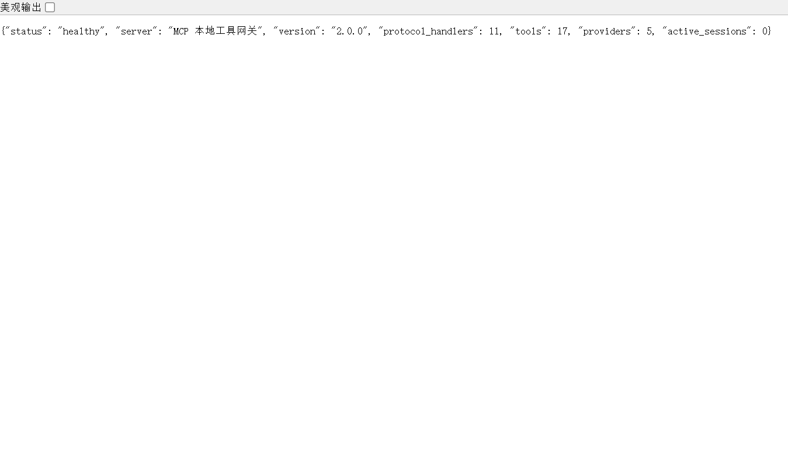
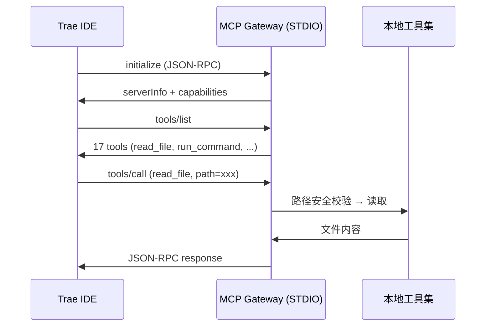
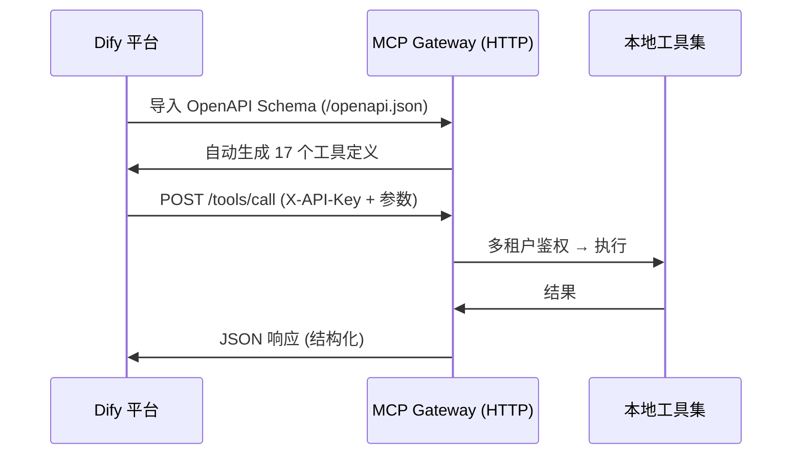
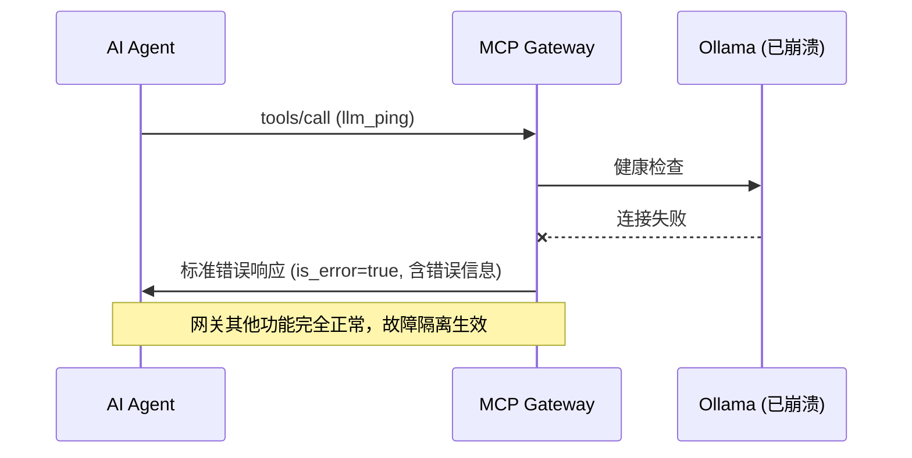

> **MCP Agent Gateway v2.0** — 一个让 AI Agent（Trae / Dify / Cursor）安全操控本地环境的 MCP 网关。
> 核心亮点：(1) **协议内核统一 + 传输层薄适配**，单套 JSON-RPC 内核同时服务 STDIO 和 HTTP；(2) **Ollama 故障隔离**，单模型崩溃不会影响网关工具调用能力；(3) **Dify 原生适配**，自动生成 OpenAPI Schema 一键导入，无需手动配 HTTP 节点。

<p align="center">
  <h1 align="center">MCP Agent Gateway v2.0</h1>
  <p align="center">
    <b>协议内核统一 + 传输层薄适配 + 可插拔中间件管道</b><br>
    让 AI Agent 直接操控本地环境的 MCP 网关
  </p>
</p>

<p align="center">
  
  
  
  
  
  
  
  
  
</p>

---

## 界面速览

<table>
  <tr>
    <td align="center">
      <br>
      <br>
      <sub>一键部署 → 健康检查确认服务在线</sub>
    </td>
    <td align="center">
      <br>
      <br>
      <sub>Trae IDE 通过 MCP 协议发现 17 个工具</sub>
    </td>
  </tr>
  <tr>
    <td align="center">
      <br>
      <br>
      <sub>自动生成 OpenAPI Schema → Dify 一键导入</sub>
    </td>
    <td align="center">
      <br>
      <br>
      <sub>实时运行监控 + 工具使用统计</sub>
    </td>
  </tr>
</table>

> 以上截图全部来自实测运行环境。完整烟测日志：[docs/screenshots/smoke_test_results.log](docs/screenshots/smoke_test_results.log)

---

## 这个项目解决什么问题？

AI Agent（如 Trae、Dify、Cursor）在和本地环境交互时面临三重障碍：

| 障碍 | 具体表现 | 本项目的解法 |
|------|----------|------------|
| **协议割裂** | Trae 用 STDIO MCP，Dify 用 HTTP REST API，两套代码两套维护 | 单套 JSON-RPC 协议内核 + 薄传输层适配，一套代码同时服务两端 |
| **安全风险** | Agent 能操作文件、执行命令、调数据库，权限控制缺失 | 多租户 API Key 认证 + 路径白名单沙箱 + 工具权限隔离 |
| **集成成本** | 每个平台都要手动配 HTTP 节点、写接口文档 | Dify 秒级适配：自动生成 OpenAPI Schema 一键导入；Trae 一行配置：JSON 模板复制即用 |

简单说：**你只需要启动一个网关，Trae 和 Dify 都能用，而且安全、可控、开箱即用。**

---

## 30 秒快速启动

```bash
git clone https://github.com/wuwo1979/agent.git && cd agent
pip install -r requirements/runtime.txt
python main.py                                   # 启动网关 (HTTP 模式, 端口 9090)
```

```bash
# 验证
curl -X POST http://localhost:9090/mcp \
  -H "Content-Type: application/json" \
  -d '{"jsonrpc":"2.0","id":"1","method":"tools/list","params":{}}'
```

---

## 实际使用流程

### 场景一：Trae IDE 中使用（STDIO 模式）



**实测效果：** Trae IDE 内可直接让 AI 读写文件、执行命令、查询数据库、调用 Ollama 模型，所有操作受权限控制。

### 场景二：Dify 平台中使用（HTTP REST 模式）



**实测效果：** Dify 内导入 Schema 即可使用所有工具，无需手动配置 HTTP 节点。

### 场景三：Ollama 崩溃了会怎样？



**实测效果：** Ollama 崩溃时返回标准化错误码，不影响文件读写、命令执行等其他工具。

---

## 内置工具一览

| Provider | 工具 | 适用场景 |
|----------|------|---------|
| **filesystem** | `read_file`, `write_file`, `list_dir`, `search_files`, `file_stat` | 读写项目文件、搜索代码、管理资源 |
| **terminal** | `run_command`, `sysinfo` | 执行编译/测试命令、获取系统信息 |
| **database** | `query`, `execute`, `list_tables`, `describe_table` | 查数据库、执行迁移、分析数据 |
| **web** | `web_fetch`, `web_api`, `json_query` | 爬取网页、调用 API、解析 JSON |
| **llm** | `llm_call`, `llm_ping`, `llm_list_models` | 本地推理、检查 Ollama 状态 |

全部 17 个工具：`python main.py --demo`

---

## 架构设计

### 协议内核统一

```
                    ┌──────────────────────────────────────────┐
                    │         AI Agent  (Trae / Dify / Cursor)  │
                    └────────┬──────────────┬──────────────────┘
                             │              │
                    STDIO    │              │   HTTP REST
                    (JSON-RPC)│              │   (JSON-RPC)
                             │              │
                    ┌────────▼──────────────▼──────────────────┐
                    │          MCP Transport Layer              │
                    │    STDIOTransport  │  HTTPTransport       │
                    └────────┬──────────────┬──────────────────┘
                             │              │
                             └──────┬───────┘
                                    │  JSONRPCRequest
                    ┌───────────────▼──────────────────────────┐
                    │        MCPProtocolHandler (唯一执行入口)    │
                    │                                          │
                    │  ┌─────────────────────────────────┐     │
                    │  │   Middleware Pipeline             │     │
                    │  │  before: [Auth] → [RateLimit]    │     │
                    │  │  core:  [ToolExecutor]           │     │
                    │  │  after: [Audit] → [Cache]        │     │
                    │  └─────────────────────────────────┘     │
                    │                                          │
                    │  ┌─────────────────────────────────┐     │
                    │  │   ToolRegistry (17 tools)        │     │
                    │  │  Filesystem │ Terminal │ DB      │     │
                    │  │  Web        │ LLM      │         │     │
                    │  └─────────────────────────────────┘     │
                    └───────────────┬──────────────────────────┘
                                    │
                    ┌───────────────▼──────────────────────────┐
                    │          本地资源 (沙箱安全)               │
                    │  文件系统 │ 终端Shell │ 数据库 │ Ollama   │
                    └──────────────────────────────────────────┘
```

### 升级亮点 (v1.3 → v2.0)

| 维度 | v1.3 (旧) | v2.0 (新) |
|------|-----------|-----------|
| **执行入口** | 两条路径：API 直接调 registry + ProtocolHandler 独立处理 | 唯一入口：`MCPProtocolHandler.handle_request()` |
| **中间件** | 无 | 可插拔管道：Auth → RateLimit → Audit → Cache |
| **错误码** | 自定义 | JSON-RPC 2.0 标准 |
| **Ollama 故障** | 无隔离，崩溃波及整个网关 | 故障隔离，单模型崩溃不影响其他工具 |
| **Dify 集成** | 手动配 HTTP 节点 | 自动生成 OpenAPI Schema 一键导入 |
| **会话管理** | 无跨传输共享 | SessionContext 统一跨 STDIO/HTTP |
| **可观测性** | 无统一指标 | 协议内核统一收集，stats 端点 |

---

## 生态适配

| 平台 | 方式 | 验证状态 | 一句话说明 |
|------|------|----------|-----------|
| **Trae IDE** | STDIO (MCP) | ✅ 通过 | 标准 MCP 配置，可调全部 17 工具 |
| **Dify** | HTTP REST API | ✅ 通过 | 导入 OpenAPI Schema 一键注册所有工具 |
| **Cursor** | STDIO / HTTP | ✅ 兼容 | 同上，支持 setup_mcp.py 一键配置 |
| **VS Code** | STDIO / HTTP | ✅ 兼容 | 通过 MCP 插件接入 |
| **Ollama** | REST API | ✅ 通过 | 内置 llm_call / llm_ping / llm_list_models |
| **curl / HTTP** | REST / MCP | ✅ 通过 | 任意语言直接调用 |

---

## 运行方式

```bash
# HTTP 模式 —— 供 Dify / 浏览器 / curl 调用
python main.py --host 0.0.0.0 --port 9090

# STDIO 模式 —— 供 Trae / Cursor / VS Code 调用
python main.py --mode stdio

# 状态监控
python main.py --status

# 演示
python main.py --demo
```

### 集成到各平台

**Trae / Cursor**：在 MCP 设置中添加：

```json
{
  "mcpServers": {
    "agent-mcp-gateway": {
      "command": "python",
      "args": ["<项目路径>/main.py", "--mode", "stdio"],
      "env": {"MCP_API_KEY": "your-key", "MCP_WORKSPACE": "<项目路径>"}
    }
  }
}
```

> 一键配置：`python scripts/setup_mcp.py`

**Dify**：在自定义工具中导入 OpenAPI Schema：
- URL：`http://localhost:9090/api/v1/openapi.json`
- 认证：`X-API-Key`

---

## 项目结构

```
LLM/
├── mcp_gateway/              # 核心网关
│   ├── server.py             # 服务入口 + 中间件装配
│   ├── protocol.py           # 协议内核 + 中间件管道 (唯一执行入口)
│   ├── transport.py          # 传输层 (HTTP/STDIO 薄适配)
│   ├── api.py                # REST → JSON-RPC 适配器
│   ├── security.py           # 认证 / 速率限制 / 策略引擎
│   ├── audit.py              # 统一审计日志
│   ├── tenancy.py            # 多租户管理
│   ├── workspace.py          # 工作区管理 + 提示词模板
│   └── tools/                # 工具提供者
│       ├── filesystem.py     # 5 个文件系统工具
│       ├── terminal.py       # 2 个终端工具
│       ├── database.py       # 4 个数据库工具
│       ├── web.py            # 3 个网页工具
│       └── llm.py            # 3 个大模型工具
├── core/                     # 基础设施
│   ├── types.py              # JSON-RPC 类型定义
│   └── exceptions.py         # 统一异常体系
├── config/                   # YAML 配置
├── tests/                    # 108 个测试
├── docs/                     # 文档 + 截图素材
├── scripts/                  # 工具脚本
├── docker/                   # Docker 部署
└── main.py                   # 入口
```

---

## 测试

```bash
# 全部 108 个测试
pytest

# 双场景端到端验证 (Trae STDIO + Dify HTTP)
pytest tests/test_scenarios.py -v

# 导入 + 安全校验验证
python tests/verify_imports.py

# 全场景冒烟测试 + 素材采集
python docs/smoke_test.py

# 代码风格
ruff check .
```

---

## 文档

| 文档 | 内容 |
|------|------|
| [Trae 接入指南](docs/Trae接入指南.md) | Trae IDE MCP 配置步骤 |
| [Dify 接入指南](docs/Dify平台自定义工具接入指南.md) | Dify 自定义工具节点配置 |
| [架构设计](docs/架构设计.md) | 分层架构详解 |
| [设计决策](docs/设计决策.md) | 技术选型决策记录 |
| [烟测报告](docs/screenshots/smoke_test_results.log) | 全场景冒烟测试结果 |

---

## License

MIT