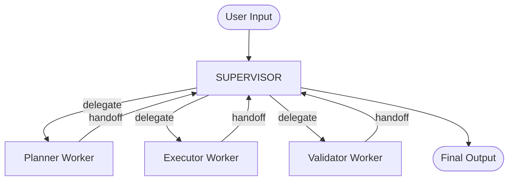

# LangGraph 实战指南

> 掌握状态定义、分支判断、工具调用、子图拆分

---

## 一、LangGraph 核心概念

### 1.1 什么是 LangGraph？

LangGraph 是 LangChain 生态中的图状态机框架，用于构建复杂的 Agent 工作流。

```
传统 Chain：A → B → C → D（线性）
LangGraph：A → B → C → D（条件分支）
                ↘ E ↗（循环/重试）
```

### 1.2 核心组件

| 组件 | 说明 | 本项目使用 |
|------|------|------------|
| StateGraph | 状态图容器 | Agent 工作流 |
| Node | 图节点（处理函数） | 规划/执行/校验 |
| Edge | 普通边（固定路由） | 节点间连接 |
| ConditionalEdge | 条件边（动态路由） | 失败重试判断 |
| Checkpointer | 状态持久化 | 断点续跑 |
| SubGraph | 子图嵌套 | 复杂 Agent 拆分 |

---

## 二、状态定义

### 2.1 基本状态

```python
from typing import TypedDict, List, Annotated
from langgraph.graph import StateGraph

class AgentState(TypedDict):
    # 任务信息
    task_id: str
    user_input: str
    
    # 执行计划
    plan: List[dict]
    current_step: int
    
    # 消息历史
    messages: List[dict]
    
    # 执行结果
    tool_results: dict
    final_output: str
    
    # 错误与重试
    errors: List[str]
    retry_count: int
```

### 2.2 状态更新策略

```python
# 追加策略（消息历史）
def add_message(state: AgentState, message: dict) -> AgentState:
    return {"messages": state["messages"] + [message]}

# 替换策略（当前步骤）
def set_step(state: AgentState, step: int) -> AgentState:
    return {"current_step": step}
```

### 2.3 本项目状态设计

```python
# agent_scheduler/state.py 中的完整设计
@dataclass
class AgentState:
    task_id: str
    user_input: str
    task_status: TaskStatus  # 枚举：PENDING/PLANNING/EXECUTING/VALIDATING/RETRYING/COMPLETED/FAILED
    plan: List[SubTask]      # 子任务列表
    current_step: int
    messages: List[dict]
    tool_results: dict
    validation_result: dict
    final_output: str
    
    # 性能指标
    start_time: float
    end_time: float
    total_tokens: int
    
    # 错误与重试
    errors: List[str]
    retry_count: int
    max_retries: int = 3
    
    # 快照版本
    snapshot_version: int
```

---

## 三、分支判断（条件路由）

### 3.1 路由函数

```python
def routing_function(state: AgentState) -> str:
    """根据状态决定下一步"""
    
    # 失败重试
    if state.task_status == TaskStatus.FAILED:
        if state.retry_count < state.max_retries:
            return "planning"  # 重新规划
        return END            # 放弃
    
    # 校验不通过 → 重新规划
    if state.task_status == TaskStatus.RETRYING:
        return "planning"
    
    # 正常流程
    if state.task_status == TaskStatus.PLANNING:
        return "execution"
    if state.task_status == TaskStatus.EXECUTING:
        return "validation"
    
    return END
```

### 3.2 条件边配置

```python
workflow.add_conditional_edges(
    "planning",
    routing_function,
    {
        "execution": "execution",  # 规划完成 → 执行
        END: END,                   # 规划失败 → 结束
    }
)

workflow.add_conditional_edges(
    "execution",
    routing_function,
    {
        "validation": "validation",  # 执行完成 → 校验
        "planning": "planning",      # 执行失败 → 重试
        END: END,
    }
)

workflow.add_conditional_edges(
    "validation",
    routing_function,
    {
        "planning": "planning",  # 校验不通过 → 重新规划
        END: END,                # 校验通过 → 结束
    }
)
```

---

## 四、工具调用

### 4.1 节点内工具调用

```python
# 执行节点
async def execution_node(state: AgentState) -> AgentState:
    """执行节点：按计划调用工具"""
    
    for task in state.plan:
        if task.status == TaskStatus.PENDING:
            # 调用 MCP 工具
            result = await tool_registry.call_tool(
                task.tool_name,
                task.arguments
            )
            
            # 更新状态
            task.result = result.content
            task.status = TaskStatus.COMPLETED
            state.tool_results[task.id] = result.content
    
    state.task_status = TaskStatus.EXECUTING
    return state
```

### 4.2 并行工具调用

```python
async def parallel_execution_node(state: AgentState) -> AgentState:
    """并行执行无依赖工具"""
    
    # 找出无依赖的待执行任务
    ready_tasks = [
        t for t in state.plan
        if t.status == TaskStatus.PENDING
        and all(dep in completed for dep in t.dependencies)
    ]
    
    # 并行执行
    tasks = [tool_registry.call_tool(t.tool_name, t.arguments) for t in ready_tasks]
    results = await asyncio.gather(*tasks)
    
    for task, result in zip(ready_tasks, results):
        task.result = result.content
        task.status = TaskStatus.COMPLETED
    
    return state
```

---

## 五、子图拆分

### 5.1 子图定义

```python
# 复杂 Agent 可以拆分为子图
def create_planning_subgraph():
    """规划子图：分析 → 拆解 → 验证"""
    subgraph = StateGraph(PlanningState)
    
    subgraph.add_node("analyze", analyze_node)
    subgraph.add_node("decompose", decompose_node)
    subgraph.add_node("verify", verify_plan_node)
    
    subgraph.set_entry_point("analyze")
    subgraph.add_edge("analyze", "decompose")
    subgraph.add_edge("decompose", "verify")
    subgraph.add_edge("verify", END)
    
    return subgraph.compile()

# 主图中使用子图
main_workflow.add_node("planning", create_planning_subgraph())
```

### 5.2 多 Agent 子图拆分

```
主图 (AgentGraph)
├── 规划子图 (PlannerSubGraph)
│   ├── 意图分析
│   ├── 任务拆解
│   └── 计划验证
├── 执行子图 (ExecutorSubGraph)
│   ├── 依赖分析
│   ├── 并行调度
│   └── 结果收集
└── 校验子图 (ValidatorSubGraph)
    ├── 结果检查
    ├── 质量评分
    └── 建议生成
```

---

## 六、断点续跑（Checkpoint）

### 6.1 Checkpointer 配置

```python
from langgraph.checkpoint.memory import MemorySaver
from langgraph.checkpoint.sqlite import SqliteSaver

# 内存检查点（开发环境）
memory = MemorySaver()
graph = workflow.compile(checkpointer=memory)

# SQLite 持久化（生产环境）
sqlite_saver = SqliteSaver.from_conn_string("checkpoints.db")
graph = workflow.compile(checkpointer=sqlite_saver)
```

### 6.2 断点续跑实现

```python
# 保存状态快照
config = {"configurable": {"thread_id": task_id}}
await graph.ainvoke(state, config)

# 恢复执行
resumed_state = await graph.ainvoke(None, config)
```

### 6.3 本项目实现

```python
class SnapshotManager:
    """状态快照管理器"""
    
    def save(self, state: AgentState) -> str:
        """保存快照到磁盘"""
        state.snapshot_version += 1
        filepath = f"snapshots/{state.task_id}_v{state.snapshot_version}.snapshot"
        with open(filepath, "wb") as f:
            pickle.dump(state.to_dict(), f)
        return filepath
    
    def load(self, task_id: str, version: int = -1) -> AgentState:
        """从磁盘恢复快照"""
        filepath = f"snapshots/{task_id}_v{version}.snapshot"
        with open(filepath, "rb") as f:
            data = pickle.load(f)
        return AgentState.from_dict(data)
```

---

## 七、完整工作流示例

```python
from langgraph.graph import StateGraph, END

# 1. 构建图
workflow = StateGraph(AgentState)

# 2. 添加节点
workflow.add_node("planning", planning_node)
workflow.add_node("execution", execution_node)
workflow.add_node("validation", validation_node)

# 3. 设置入口
workflow.set_entry_point("planning")

# 4. 添加条件边
workflow.add_conditional_edges("planning", router, {
    "execution": "execution",
    END: END,
})
workflow.add_conditional_edges("execution", router, {
    "validation": "validation",
    "planning": "planning",  # 重试回路
    END: END,
})
workflow.add_conditional_edges("validation", router, {
    "planning": "planning",  # 校验不通过
    END: END,
})

# 5. 编译
graph = workflow.compile(checkpointer=MemorySaver())

# 6. 运行
result = await graph.ainvoke(
    AgentState(user_input="分析代码并优化性能"),
    config={"configurable": {"thread_id": "task_001"}}
)
```

---

## 八、Supervisor-Worker 模式（多Agent协调）

### 8.1 架构对比

```
传统 Pipeline 模式：          Supervisor-Worker 模式：
  Planner → Executor → Validator    Supervisor（中心协调）
                                      ├── Planner Worker
                                      ├── Executor Worker
                                      └── Validator Worker
```

### 8.2 Supervisor-Worker 核心设计

```python
# agent_scheduler/supervisor.py

class SupervisorAgent:
    """中心协调者：动态路由 + Handoffs + 流式输出"""

    def __init__(self, planner, executor, validator):
        self.planner = planner
        self.executor = executor
        self.validator = validator
        self.worker_metrics = {
            "planner": {"calls": 0, "total_time_ms": 0, "errors": 0},
            "executor": {"calls": 0, "total_time_ms": 0, "errors": 0},
            "validator": {"calls": 0, "total_time_ms": 0, "errors": 0},
        }

    async def run(self, state: AgentState) -> AgentState:
        # Phase 1: Planning
        state = await self._delegate_to_planner(state)
        # Phase 2: Execution
        state = await self._delegate_to_executor(state)
        # Phase 3: Validation
        state = await self._delegate_to_validator(state)
        return state

    async def run_streaming(self, state: AgentState):
        """流式输出：实时推送进度"""
        yield {"status": "started", "role": "supervisor", "progress": 0.0}
        yield {"status": "running", "role": "planner", "progress": 0.1}
        state = await self._delegate_to_planner(state)
        yield {"status": "completed", "role": "planner", "progress": 0.3}
        # ... executor, validator ...
```

### 8.3 Handoffs（交接）机制

Supervisor 通过 `_delegate_to_*` 方法实现 Worker 交接：

```python
async def _delegate_to_planner(self, state: AgentState) -> AgentState:
    """将任务交接给 Planner Worker"""
    t0 = time.time()
    self.worker_metrics["planner"]["calls"] += 1
    try:
        state = await self.planner.plan(state)
        elapsed = (time.time() - t0) * 1000
        self.worker_metrics["planner"]["total_time_ms"] += elapsed
        return state
    except Exception as e:
        self.worker_metrics["planner"]["errors"] += 1
        state.add_error(f"Planner error: {e}")
        return state
```

### 8.4 Mermaid 架构图



---

## 九、常见问题

**Q: LangGraph vs LangChain AgentExecutor？**

| 特性 | LangGraph | AgentExecutor |
|------|-----------|---------------|
| 控制流 | 图状态机（灵活） | 线性循环（固定） |
| 条件分支 | 原生支持 | 需要 hack |
| 断点续跑 | 内置 Checkpoint | 需自行实现 |
| 并行执行 | 天然支持 | 不支持 |
| 学习曲线 | 中等 | 低 |

**Q: 如何处理 Agent 循环调用？**

- 设置 `max_retries` 限制重试次数
- 路由函数中加入循环检测
- 使用 `recursion_limit` 配置最大递归深度